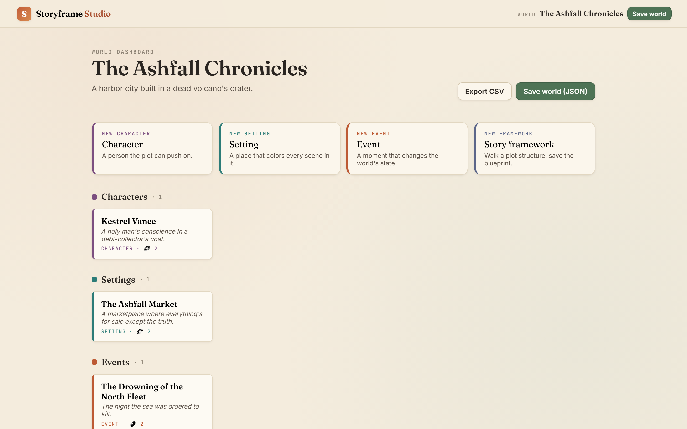
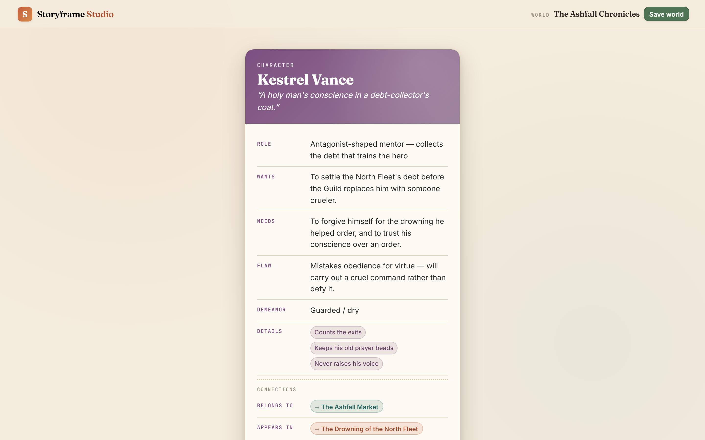
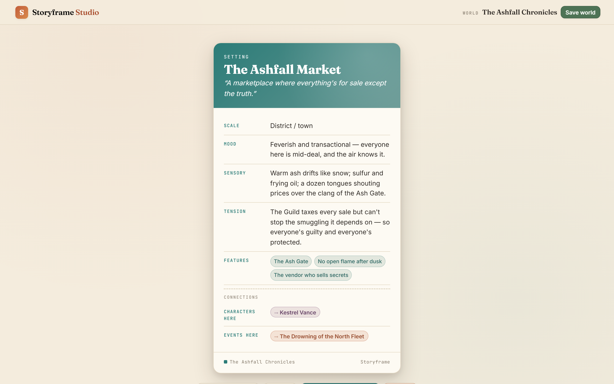
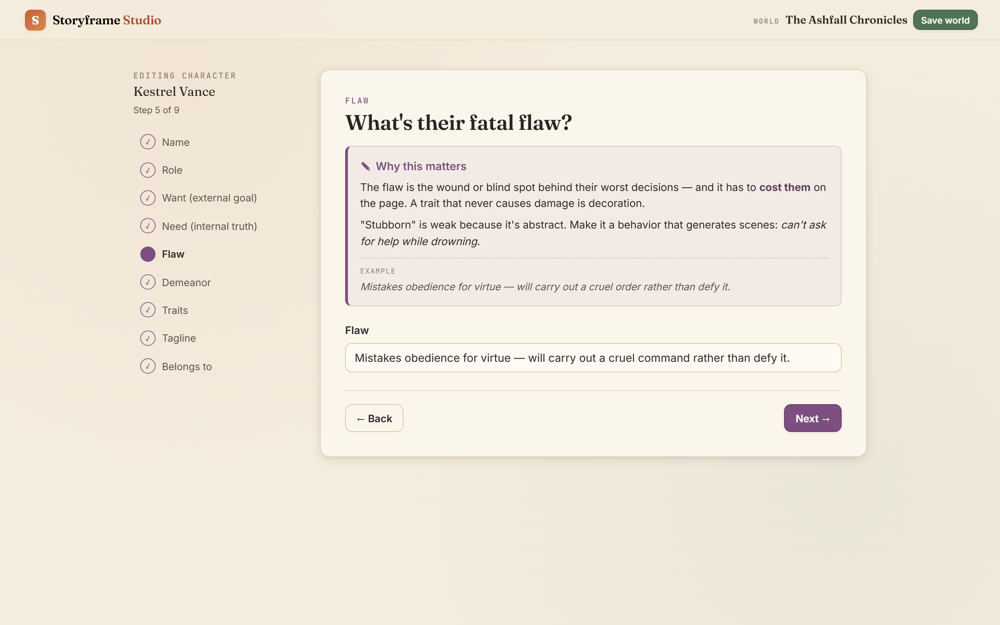
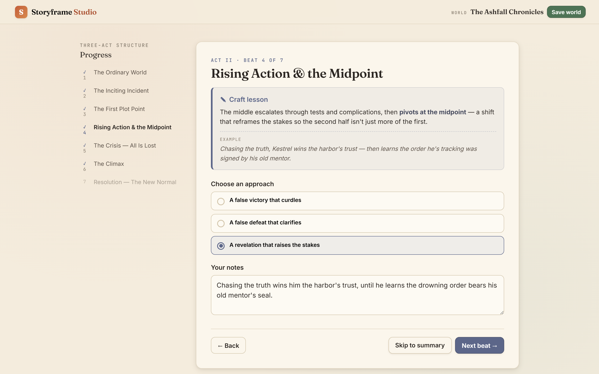
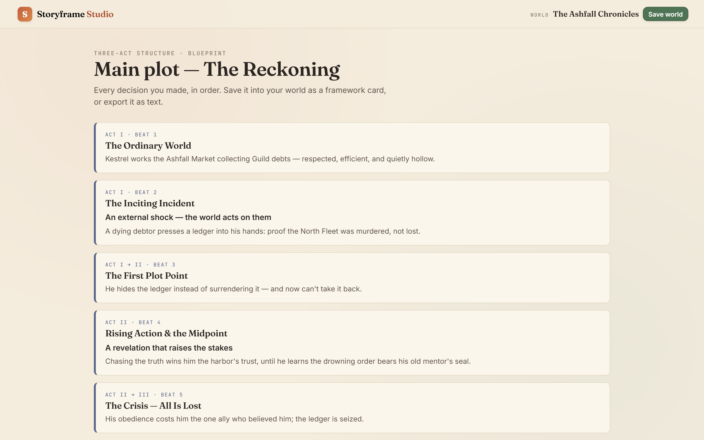
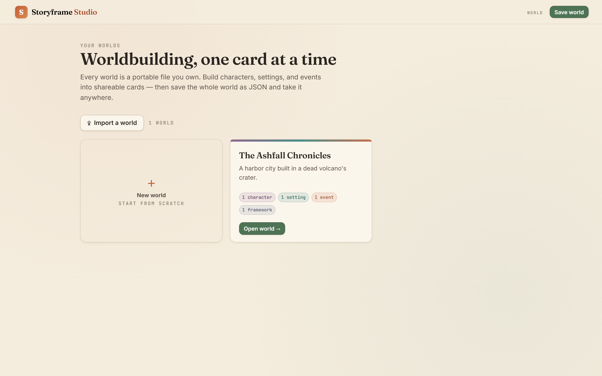
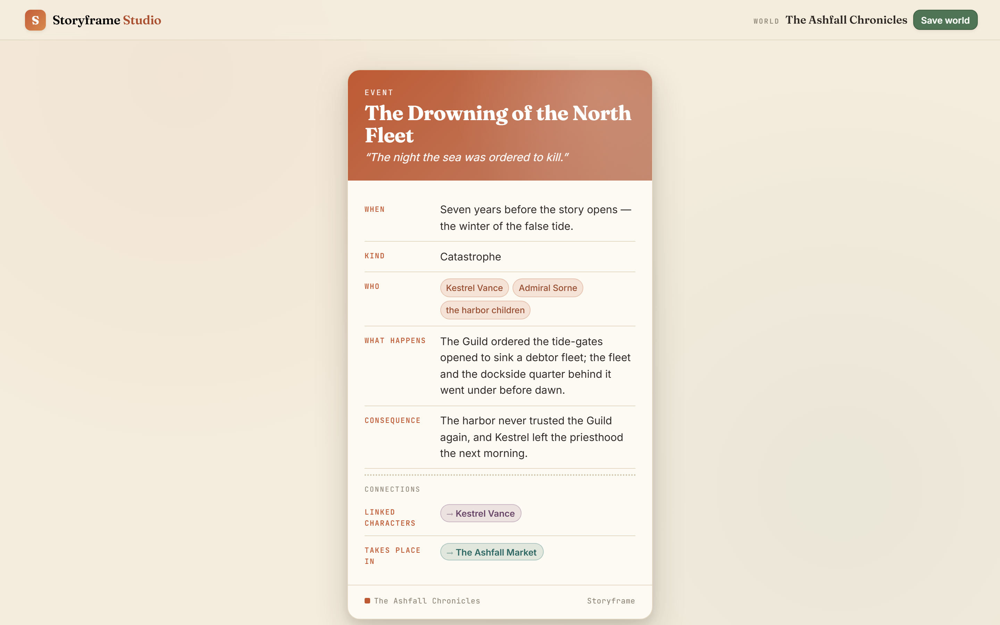

# Storyframe Studio

**A local-first, no-AI worldbuilding tool for fiction writers.** It turns
scattered story ideas into structured, shareable **cards** — characters,
settings, and events — organized into saveable **worlds**, and teaches craft
along the way. It never writes prose for you. The problem isn't generating
words; it's *organization, direction, and craft*. Storyframe Studio is guided
authoring: it helps you make and record the structural decisions, and explains
the *why* at every step.

Everything runs offline in a single HTML file. No accounts, no backend, no
network calls, no AI. Your world is a portable JSON file you own.



---

## Why it exists

Most writing tools either get out of your way (a blank page) or try to write
*for* you (AI). Neither helps the writer who has ideas but struggles to organize
and shape them. Storyframe Studio sits in the gap:

- **The card solves _legibility_** — a scattered idea becomes a thing you can show.
- **The world solves _accumulation_** — many ideas become a browsable set.
- **The craft lessons solve _skill_** — you get better, not just organized.

**The card is the hero.** Every wizard exists to produce one:

<p align="center">
  
  
</p>

Each entity type carries its own accent colour (characters = plum, settings =
teal, events = terracotta) so a world reads colour-coded at a glance.

## The teaching layer (the differentiator)

Every wizard step comes with a craft lesson — the *why*, a concrete example, and
the common failure mode. This is a tool that makes you a better writer as you use
it, not just a nicer form.



The same teaching runs through the **story-framework module** — walk a plot
structure (Three-Act, Hero's Journey) one decision at a time, then save the
blueprint into your world:

<p align="center">
  
  
</p>

And it all starts from your worlds:



## Connections — the world model

Cards don't sit in isolation. Link an event to the characters it involves and the
setting it happens in; a character to the settings they belong to. Each card then
shows its connections as clickable chips **coloured by the type they point to** —
and the reverse links are computed automatically, so a location's card lists the
events that happened there and the people who belong to it, with no extra data
stored.



This is what turns a pile of cards into a *world model* — and it's why the event's
free-text "Who's involved" field exists alongside real character links: loose
mentions for anyone, hard links for the cards that earn one. Links are stored as
ids in the `World` JSON, round-trip losslessly, and are scrubbed automatically
when a linked entity is deleted (no dangling references).

---

## Run it

No build step needed to *use* it — it's a single file:

```
Open dist/storyframe-studio.html in any modern browser.
```

Or work from source (`src/index.html` + `src/app.js`) and rebuild the bundle:

```bash
npm install          # dev tooling only (jsdom, playwright, sharp)
npm run build        # inline src/app.js into a single dist/storyframe-studio.html
npm test             # headless smoke test (7 checks) — must be green
npm run screenshots  # seed a demo world and capture the frames above
```

- **`npm run build`** — reads `src/index.html`, inlines `src/app.js`, writes the
  single-file `dist/storyframe-studio.html`. No bundler, no transpile.
- **`npm test`** — drives the real app in jsdom and asserts the core flows
  (init → wizard → card, CSV header, JSON round-trip, framework summary,
  entity linking + computed reverse links + delete-cleanup) — 10 checks.
- **`npm run screenshots`** — builds, seeds *The Ashfall Chronicles*, and drives
  a headless Chromium to each screen (1440×900 @2x → `assets/screenshots/`, plus
  16:10 WebP copies ≤300 KB → `assets/portfolio/`).

## Save, load & export

- **Save world → JSON** (`*.storyframe.json`) — the real save format. Pretty-
  printed, lossless, portable.
- **Load** — file picker *or* drag a `.storyframe.json` onto the page. Bad files
  fail non-destructively with a toast.
- **Export CSV** (`*-world.csv`) — a flattened view for spreadsheets / Notion.
  Export-only, never the save format.
- **Download card as image** (PNG) — rendered with SVG `foreignObject` + canvas,
  no external libraries.

> Persistence is deliberately explicit: no `localStorage`/`sessionStorage` (they
> are unreliable in some embedding contexts). Data lives in memory during a
> session; you save and load files yourself.

---

## The data-model contract (why this stays maintainable)

The single most important architectural rule: **the world data is never coupled
to the UI.** The canonical state lives only in a plain data object; the DOM is
always derived from it and never the source of truth.

```
store = { projects: [World, ...], activeId: string | null }

World  = { id, name, desc, created, entities: [Entity, ...] }

Entity = {
  id, type: "character" | "setting" | "event" | "framework", name, created,
  // character / setting / event:
  data: { [fieldKey]: string | string[] },
  links: { [relKey]: entityId[] },   // relationship layer — ids, not names
  // framework blueprints:
  frameworkKey, frameworkName,
  answers: { [stepIndex]: { choice: number|null, note: string } },
  summary, plaintext
}
```

Because of this, `serializeWorld(world)` can produce the full, lossless save
**at any moment with no UI present** — which is exactly what the headless test
asserts. This is the "grow into an app" contract: when Storyframe Studio later
gains accounts and a database, this `World` JSON is what the backend ingests,
untouched.

---

## How to extend it

The whole app is content-first. The most common edits need **no new code.**

### Add a field to an entity

In `src/app.js`, find the entity's `SCHEMA` (e.g. `SCHEMAS.character`) and add a
step to its `steps` array, then map it onto the card in `card.rows`:

```js
// 1. Add the wizard step (with its craft lesson — required, not optional):
{
  key: "secret", label: "Secret", type: "textarea",
  placeholder: "What are they hiding?",
  teach: `<p>A secret is a <strong>delayed reveal</strong> — plant it now…</p>`,
  example: "He still pays the drowned admiral's widow, anonymously.",
},

// 2. Show it on the card:
{ key: "secret", label: "Secret" },   // add to SCHEMAS.character.card.rows
```

Field types: `text`, `textarea`, `choice` (add a `choices: [{ value, hint }]`),
`chips` (multiple tags → set `chips: true` on the card row).

### Add a story framework

Add one entry to `FRAMEWORKS` — pure content, no new code:

```js
saveTheCat: {
  key: "saveTheCat", name: "Save the Cat", tagline: "…", blurb: "…",
  nodes: [
    {
      step: "Act 1", title: "Opening Image",
      teach: `<p>…</p>`, example: "…",
      prompt: "…",
      choices: [{ value: "…" }],          // optional
      notePlaceholder: "…",
    },
    // …more beats
  ],
}
```

It appears automatically on the framework picker, walks with lessons, and saves
into worlds like any other.

### Add an entity type

Add a `SCHEMAS.<type>` entry and its accent colour in `ACCENTS`, then include the
type in `ENTITY_TYPES`. Everything else (wizard, card, dashboard grouping, CSV)
picks it up.

### Add a relationship

Add an entry to `RELATIONS[<sourceType>]`. The wizard grows a link-picker step,
the card renders the connection, and the target type's card shows the reverse
link automatically — no other code changes:

```js
RELATIONS.event.push({
  key: "faction", label: "Aligned with", target: "faction",
  reverseLabel: "Events involving this faction",
  teach: `<p>…why linking matters…</p>`,
  example: "…",
  // single: true  // uncomment for a one-pick link
});
```

---

## Roadmap

**Shipped since v1:**

- ✅ **Relationship layer.** Entities link into a navigable *world model* (events
  → characters & settings, characters → settings), with computed reverse links
  and clickable, colour-coded connections on every card. See
  [Connections](#connections--the-world-model) above.

Still ahead — prioritized, outcome-first, recorded here but not yet built:

- **v2 — More entity types.** Factions/orgs, items/artifacts, magic/tech
  systems, lore. Compositions of the existing spine.
- **v2 — More frameworks.** Save the Cat (15-beat), Kishōtenketsu (four-act).
  Pure content additions.
- **v3 — The "grow into an app" jump.** Real persistence (accounts + database),
  removing the manual save/load friction. The trigger is evidence that
  file-based saving is costing users work — that friction is the signal, not a
  schedule.

## Project layout

```
storyframe-studio/
├─ src/
│  ├─ index.html          # markup + all styling (the visual identity)
│  └─ app.js              # data model, schemas, frameworks, UI, exports
├─ dist/
│  └─ storyframe-studio.html   # built single-file distributable
├─ scripts/
│  ├─ build.mjs           # inlines app.js → dist/
│  └─ screenshots.mjs     # seeds a demo world + captures the frames
├─ test/
│  └─ smoke.test.mjs      # headless jsdom smoke test (§10)
├─ assets/
│  ├─ screenshots/        # full-res captures (1440×900 @2x)
│  └─ portfolio/          # 16:10 WebP copies, ≤300 KB
└─ docs/
   └─ BUILD_PROMPT.md     # the original spec, for provenance
```

## Tech

Vanilla HTML + CSS + one plain JS file. No frameworks, no runtime dependencies.
Dev tooling only: `jsdom` (test), `playwright` (screenshots), `sharp` (image
optimization). Fonts (Fraunces / Inter / JetBrains Mono) load via Google Fonts
as progressive enhancement and degrade to intentional system fallbacks offline.

## License

[MIT](LICENSE).
